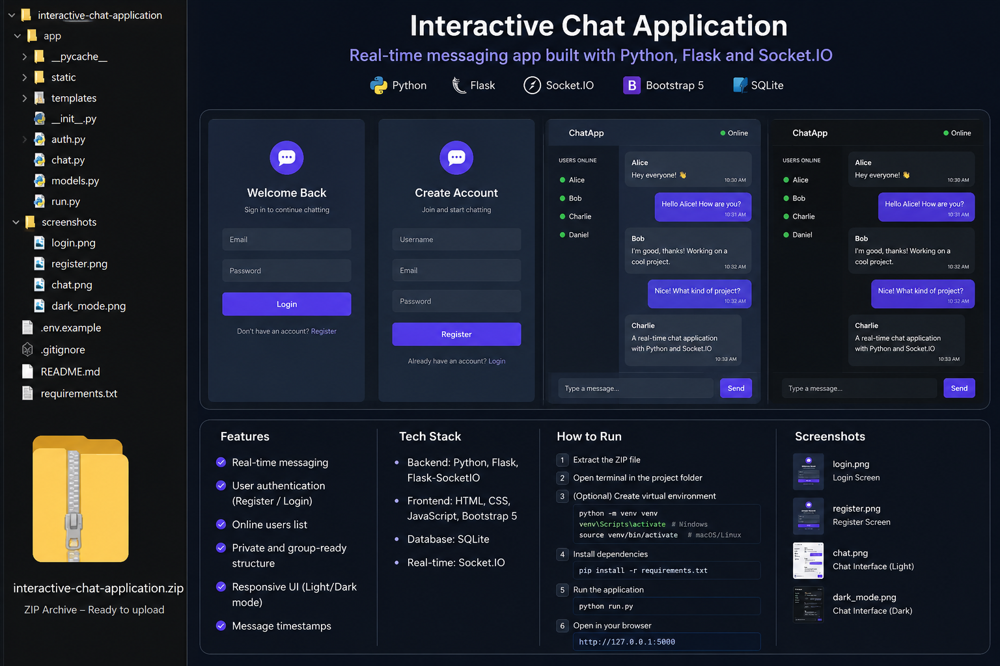

# Interactive Chat Application

This folder contains a simple yet functional chat application built with **HTML**, **CSS** and **JavaScript**. It allows a user to send messages and receive basic automated replies without any server‑side code or external dependencies. You can use it as a starting point for more advanced chat projects or share it as is to demonstrate your front‑end skills.

## Features

- Responsive and mobile‑friendly layout using plain CSS.
- Accessible markup with labelled inputs and live regions for screen reader announcements.
- Simple message handling: user messages appear on the right in blue and bot responses on the left in grey.
- Randomised replies with a small heuristic to respond differently to questions.
- Smooth scrolling to the latest message.

## How to run

No installation is required. To use the chat app:

1. Download or clone this repository.
2. Open the `index.html` file in any modern web browser (Chrome, Firefox, Safari or Edge).
3. Type a message into the input field at the bottom of the page and press **Send** or hit **Enter**.
4. The conversation will appear in the chat window above.

You can also serve the folder using a simple static web server (for example with Python or Node) if you prefer, but it is not necessary.

## Tech used

The application is intentionally lightweight:

- **HTML**: provides the structure of the chat interface.
- **CSS**: styles the page and makes it responsive. Colours and spacing are defined in `style.css`.
- **JavaScript**: adds interactivity through `chat.js`, handling user input, displaying messages and generating replies.

No frameworks or libraries are required. This makes the code easy to understand and modify for learners or interview demonstrations.

## Customisation

You can extend or customise the chat app in several ways:

- Replace the placeholder responses in `chat.js` with your own logic or connect it to a server‑side API.
- Adjust the colours, fonts and sizes in `style.css` to match your personal brand or portfolio style.
- Add features such as message timestamps, typing indicators or a message history saved to `localStorage`.

## Screenshots

A sample screenshot of the chat interface is included in the `screenshots` folder to give an idea of how it looks. You can replace it with a screenshot of your customised version.

## License

This project is released into the public domain. You are free to use, modify and distribute it without restriction. Attribution is appreciated but not required.